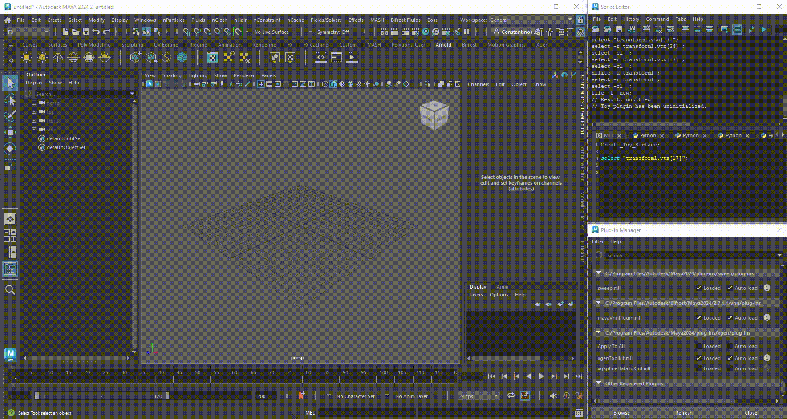

# ToySurfaceExample

  

This is a simple example of an MPxSurfaceShape using Maya's C++ API 2024 and VP2.0 that demonstrates how to:

- Create a custom shape from an MPxSurfaceShape.

- Visualize the shame in VP 2.0.

- Define a component to access the vertices of the custom shape.

- Implement selection of the vertices, either by using the 'select' command in MEL or using the mouse in the viewport.

This repository contains the source code for this demo.